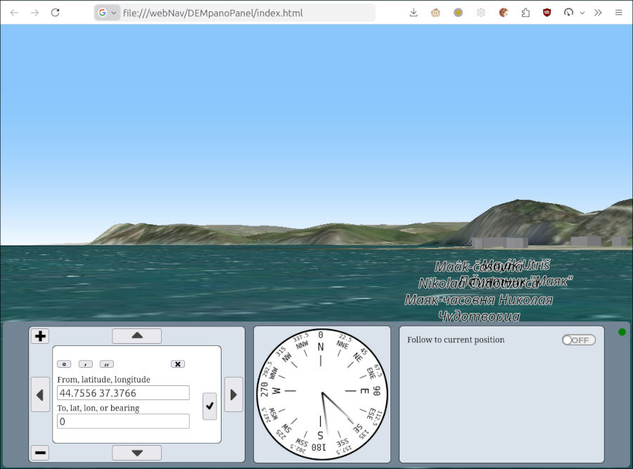

[По-русски](README.ru-RU.md)  
# DEMpanoPanel 

A web application that shows panoramic (i.e., perspective from ground level) view of the terrain based on [Digital Elevation Model (DEM)](https://www.mdpi.com/2072-4292/13/18/3581) maps and satellite images.

In its basic configuration, it can be useful for travelers and tourists who want to get a preliminary impression of the terrain that awaits them.  It's also good for sailors and people who like to sail to plan their trips and see where they are on the sea.
  
This code is written without using AI, "best practices", OOP, and an IDE.

## v. 0.1

## Features
* Configurable data sources, both local and online.
* You don't need a web server; just open the `index.html` file in your browser.
* Suitable for mobile devices.
* Buildings, geographical names and navigation signs can be displayed.
* You can specify the view point by entering coordinates or using the mouse (or touch) on the screen.
* Change the direction of your view to the right or left, move forward or backward, or change the height of your view. The current direction of your view is displayed on the indicator.
* Viewpoints can be continuously obtained from a geo-positioning device (for example, a GNSS receiver), which requires [gpsd](https://gpsd.io/) and [gpsd2websocket](https://github.com/VladimirKalachikhin/gpsd2websocket) or [gpsdPROXY](https://github.com/VladimirKalachikhin/gpsdPROXY).

## Requirements
A modern browser is required on a high-performance device with sufficient RAM and a wide screen.  
Firefox is preferred. Chrome is not recommended, and Edge is not supported.

## Demo
[Sukko, Black sea, Russia](https://vladimirkalachikhin.github.io/DEMpanoPanel/)

## Installation
### Dependencies
The [maplibre](https://maplibre.org/) library is used. Due to the library's rapid variability, an instance of it is included in the project files, so no dependencies need to be installed. It is also not recommended to update the library.  
<small>Maplibre may not be the best choice for the task at hand, but I was interested in its capabilities...</small>
### Launching the application without using a web server
No installation is required. Just copy all the files to any directory and open `index.html ` in the browser.
### Launching the application via a web server
Copy all the files to the web server's data directory. If necessary (rights, etc.), make changes to the configuration of the web server according to its documentation.

## Configuration
The configuration parameters are in the file `options.js `. The file is commented in detail, so the purpose of each parameter should be clear.  
Initially, the file contains a configuration for using data from the Internet and running the application without using a web server. That is, no configuration is required for introductory use. For real-world use, change the settings as needed.
### Local data
Instead of receiving data directly from the Internet, it is better to use a caching proxy server. Recommended [GaladrielCache](https://github.com/VladimirKalachikhin/Galadriel-cache).  
You will need a font to display the toponyms. The necessary fonts are included in the chartplotter. [GaladrielMap](https://github.com/VladimirKalachikhin/Galadriel-map).

## Using
### Manual set of the viewing point and viewing direction
Enter the geographic coordinates of the viewpoint in the upper field of the control panel, and the direction of view or coordinates of the observation target in the lower field.  
The coordinate format can be almost anything: traditional writing, any lat - long, lng or longitude writing, or simply two numbers separated by a space. In the latter case, the first number is interpreted as latitude, and the second number is interpreted as longitude.  
The direction of view is the azimuth in any form.  
For convenience, there are corresponding buttons for entering coordinates in the form of degrees-minutes-seconds. The rightmost button with a cross clears the current input field.  
Another way to enter a point of view and the direction of view is to specify these points with the mouse or by touching the screen. Select the required input field, then click on the dot in the view. The coordinates of the point will be recorded in the field.

After entering the coordinates, click the checkmark button to the right of the input fields. The view will be built.  

You can view the surroundings of the specified point by pressing the arrow buttons along the edge of the control panel. The + and - buttons change the conditional height of the viewpoint.  
These movements do not change the initial set point of view and the direction of view. You can always return to it by clicking the check mark button.

The specified coordinates are stored in the browser and will be restored the next time the application is launched.

### Getting viewpoints from a coordinate source
The application can continuously receive coordinates and direction in [gpsd format](https://gpsd.io/gpsd_json.html) from [gpsd2websocket](https://github.com/VladimirKalachikhin/gpsd2websocket) or [gpsdPROXY](https://github.com/VladimirKalachikhin/gpsdPROXY), which, in turn, receive this data from the [gpsd](https://gpsd.io/) daemon. The daemon can receive coordinates either from a real global navigation satellite system receiver or from a simulator of such a receiver, such as [naiveNMEAdaemon](https://github.com/VladimirKalachikhin/naiveNMEAdaemon) or [nmeasimulator](https://github.com/panaaj/nmeasimulator). This allows for virtual navigation along an existing track or, in the case of nmeasimulator, along an arbitrary route.

## Support
[Forum](https://github.com/VladimirKalachikhin/Galadriel-map/discussions)

