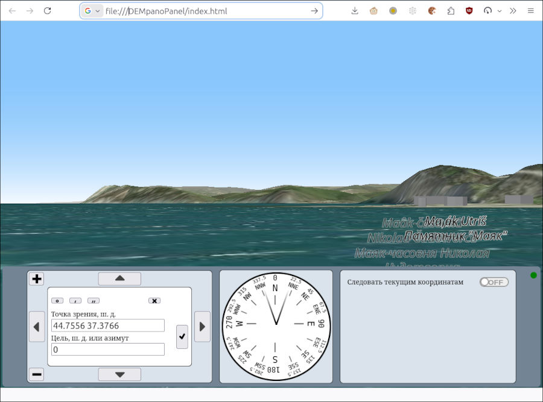

[In English](README.md)  
# DEMpanoPanel 

Веб-приложение, которое показывает панорамные (т.е. перспективные с уровня земли) изображения рельефа по данным карт [Digital Elevation Model (DEM)](https://www.mdpi.com/2072-4292/13/18/3581) и космических снимков.

В базовой конфигурации может быть полезно для путешественников и туристов, желающих получить предварительное впечатление об ожидающем их рельефе. Также может помочь яхтсменам и другим судоводителям - любителям в планировании движения и оценке своего положения в каботажном плавании.  
  
Код программы написан без использования кибернетических агентов, "лучших практик", ООП и ИСР.

## v. 0.1

## Возможности
* Конфигурируемые источники данных - как локальные, так и в Интернет.
* Не обязателен веб-сервер: достаточно открыть файл `index.html` в браузере.
* Пригодно для мобильных устройств.
* Могут отображаться строения, географические наименования и навигационные знаки.
* Указание точки обзора возможно вводом координат и с экрана мышью (или касанием).
* Изменение направление взгляда вправо - влево, смещение вперёд и назад, изменение высоты обзора. Текущее направление обзора отражается на индикаторе.
* Точки обзора можно непрерывно получать от устройства геопозиционирования (например, приёмника ГНСС), для чего требуется [gpsd](https://gpsd.io/) и [gpsd2websocket](https://github.com/VladimirKalachikhin/gpsd2websocket) или [gpsdPROXY](https://github.com/VladimirKalachikhin/gpsdPROXY).

## Требования
Требуется современный браузер на высокопроизводительном устройстве с достаточным объёмом оперативной памяти и широким экраном.  
Предпочтителен браузер Firefox. Chrome не рекомендуется, Edge не поддерживается.

## Демо
[Чёрное море, Сукко](https://vladimirkalachikhin.github.io/DEMpanoPanel/)

## Установка
### Зависимости
Используется библиотека [maplibre](https://maplibre.org/). Из-за быстрой изменчивости библиотеки экземпляр её включён в состав файлов проекта, так что никаких зависимостей устанавливать не надо. Не рекомендуется также обновлять библиотеку.  
<small>Возможно, maplibre не лучший выбор для поставленной задачи, но я заинтересовался её возможностями...</small>
### Запуск приложения без использования веб-сервера
Никакой установки не требуется. Просто скопируйте все файлы в любой каталог и откройте `index.html` в браузере.
### Запуск приложения посредством веб-сервера
Скопируйте все файлы в каталог данных веб-сервера. При необходимости (права и т.п.) внесите изменения в конфигурацию веб-сервера согласно его документации.

## Конфигурирование
Параметры конфигурации находятся в файле `options.js`. Файл подробно комментирован, так что назначение каждого параметра должно быть понятно.  
Исходно файл содержит конфигурацию для использования данных из Интернет и запуска приложения без использования веб-сервера. Т.е., для ознакомительного применения не требуется никакого конфигурирования. Для реального использования измените параметры в соответствии с необходимостью.
### Локальные данные
Вместо получения данных непосредственно из Интернет лучше использовать кеширующий прокси-сервер. Рекомендуется [GaladrielCache](https://github.com/VladimirKalachikhin/Galadriel-cache).  
Для отображения топонимов потребуется шрифт. Нужные шрифты есть в составе картплотера [GaladrielMap](https://github.com/VladimirKalachikhin/Galadriel-map).

## Использование
### Ручное указание точки обзора и направления взгляда
Укажите географические координаты точки обзора в верхнем поле управляющей панели, и направление взгляда или координаты цели наблюдения в нижнем поле.  
Формат координат может быть почти любым: традиционное русское написание, любые латинские написания или просто два числа, разделённых пробелом. В последнем случае первое число воспринимается как широта, а второе - как долгота.  
Направление взгляда - это азимут в любой форме.  
Для удобства ввода координат в форме градусы-минуты-секунды имеются соответствующие кнопочки. Правая из них - с крестиком - очищает текущее поле ввода.  
Другой способ ввода точки обзора и направления взгляда - указание этих точек мышью или касанием экрана. Выберите требуемое поле ввода, затем щёлкните по точке на изображении. Координаты точки будут записаны в поле.

Введя координаты, нажмите кнопку с "галочкой" справа от полей ввода. Изображение будет построено.  

Осмотреть окрестности указанной точки можно нажимая кнопки со стрелочками по перbферии управляющей панели. Кнопки + и - изменяют условную высоту точки зрения.  
Эти перемещения взора не меняют исходно заданную точку обзора и направление взгляда. К ней всегда можно вернуться, нажав кнопку с "галочкой".

Указанные координаты хранятся в браузере и будут восстановлены при следующем запуске приложения.

### Получение точек обзора от источника координат
Приложение может непрерывно получать координаты и направление в [формате gpsd](https://gpsd.io/gpsd_json.html) от [gpsd2websocket](https://github.com/VladimirKalachikhin/gpsd2websocket) или [gpsdPROXY](https://github.com/VladimirKalachikhin/gpsdPROXY), которые, в свою очередь, получают эти данные от демона [gpsd](https://gpsd.io/). А тот может получать координаты либо от реального приёмника глобальной навигационной спутниковой системы, или от симулятора такого приёмника. Например, от [naiveNMEAdaemon](https://github.com/VladimirKalachikhin/naiveNMEAdaemon). Или [nmeasimulator](https://github.com/panaaj/nmeasimulator). Таким образом можно организовать виртуальное плавание вдоль имеющегося трека или, в случае nmeasimulator, по произвольному маршруту.

## Поддержка
[Форум](https://github.com/VladimirKalachikhin/Galadriel-map/discussions)

